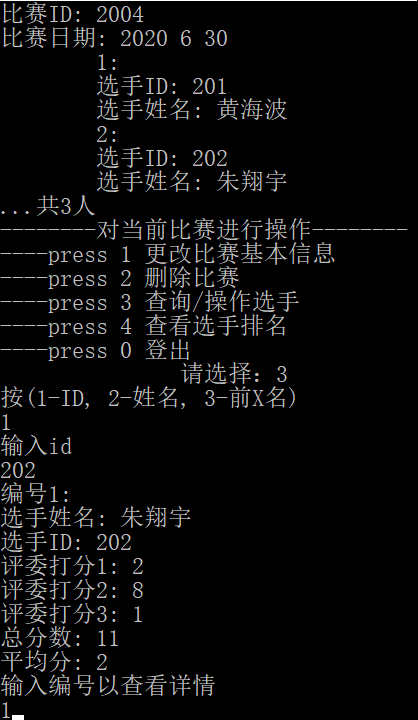
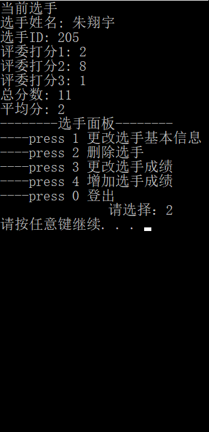
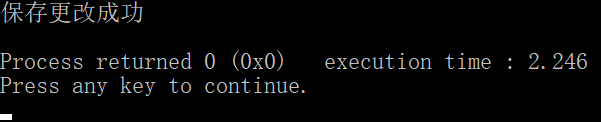

# Singer & Contest System (SCS)

The Singer & Contest System (SCS) is used by record companies to manage singer competitions. The main functions to be completed include competition management, singer management, and score management. It can perform operations such as starting a competition, managing a competition, managing a singer, and managing scores. The design and implementation of the singer management system should be completed using the C/C++ programming knowledge learned.

## Functionality

The main functions of the Singer & Contest System (SCS) are: competition list management, competition management, singer management, score management, which can complete work such as starting a competition, managing a competition, managing a singer, and managing scores. The detailed system functional structure is shown in Figure 1.

The specific description of the functions of each module of the system is as follows:

1. Competition list management module:
Select a new competition or query the existing competition, and then manage the content or basic information of the competition.
2. Competition management module:
The user can view the basic information of the selected competition, then choose to change these basic information or delete the competition, and at the same time, you can view the ranking of the players in this competition, or select the players in this competition.
3. Player management module:
You can find the personal scores of each player, view the scores of each person, and then modify the scores of a certain judge.

Maintain the competition list information:
New competition: Enter the competition state, and enter the basic information of the competition according to the prompts: id, location, date, number of judges and players, which are input sequentially by default.
Find competition: First search, list all competitions that meet the conditions, and then select the book to be modified according to the list, select one and enter the next level of the competition menu.
Maintain competition information
Change basic information: Enter the time and place of the competition, and then update the current competition and the current competition list information.
Delete competition: Delete the selected competition directly.
Query / operate players: Enter the information to query the players, and then directly find all the information of the players that meet the conditions.
View player rankings; enter the basis for querying player rankings: average score/total score, etc., and directly display the list of all players ranked according to ranking.
Maintain singer information
Change the basic information of the player: Enter the player's id and name.
Delete player: Delete the selected player directly.
Add player scores: Enter the score of the competition judgment and add the player's score.

## Demonstration

Enter "1" on the start screen to jump to the login screen.

Then enter "1" to start a new competition.

Then enter the competition information, such as:
Id:2003
Location: Hangzhou
Enter event: 2020 6 24

Next, enter the number of judges and player information.

Finally, the competition results are obtained. After saving the competition results, search for this competition.

# 歌手比赛系统

 歌手比赛系统（SCS：Singer & Contest System）用于唱片公司对歌手比赛的管理，要求完成的主要的功能包括比赛管理、歌手管理、成绩管理。可以完成进行比赛，修改比赛，修改歌手，更改成绩等操作。要求使用学习过的C/C++程序设计的知识完成歌手管理系统的设计与实现。

 ## 功能
 歌手比赛管理系统（SCS）主要功能为：比赛列表管理、比赛管理、歌手管理、成绩管理，可以完成开始比赛、管理比赛、管理歌手、管理成绩等工作。详细的系统功能结构为图1所示。
 

 系统各模块的功能具体描述为：
1、比赛列表管理模块
选择进行新比赛或者查询现有的比赛，然后对比赛的内容或者基本信息进行管理。
2、比赛管理模块
用户可以查看被选中比赛的基本信息，然后选择更改这些基本信息或者删除该比赛，同时，你可以查看本次比赛的选手排名，或者选定该比赛中的选手。
3、选手管理模块
可以查找各个选手的个人成绩，可以查看每个人的成绩，然后可以修改某个评委的评分。
维护比赛列表信息：
进行新比赛：进入比赛状态，根据提示依次输入比赛的基本信息：id，地点，日期，评委和选手的人数，默认状态下为继续输入。
查找比赛：首先进行查找，列出所有符合条件的比赛，根据列出的需要选择要修改的图书，选择某一个并且进入下一级比赛的菜单。
维护比赛信息
更改基本信息：输入比赛的时间和地点，然后更新当前比赛和当前比赛列表信息。
删除比赛：直接删除选中比赛。
查询/操作选手：输入查询选手的信息，然后直接查找符合条件的所有选手的信息。
查看选手排名；输入查询选手排名的依据：平均分/总分等等，直接显示所有选手按排名的列表。
维护歌手信息
更改选手的基本信息：输入选手的id，姓名。
删除选手：直接删除选中的选手。
增加选手成绩：输入比赛评判的成绩，增加选手成绩。

## 演示
 
 在开始界面输入“1”即可跳转到登陆界面。
 
  然后输入“1”，屏幕上进行新比赛界面。

  后输入比赛信息，如：
Id:2003
地点：杭州
输入事件:2020 6 24

接下来输入评委的人数以及选手的信息
 
 
 
最后得出比赛结果
保存比赛结果后查找这个比赛
 
使用日期通配符查找

 
选中此次比赛

 
更改这次比赛的基本信息

 
查找这个比赛当中的选手，并且选中之
 
进入选手面板
 
更改这个选手某一评委的成绩
 
删除该选手
 
此时的比赛面板

按照第i号来排名
 
退出比赛，保存修改
